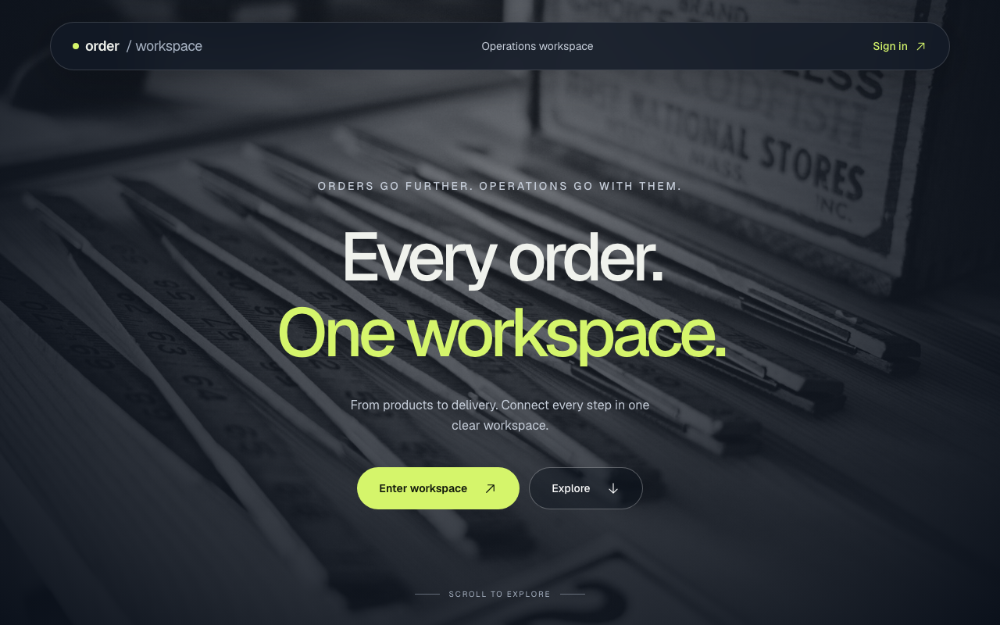
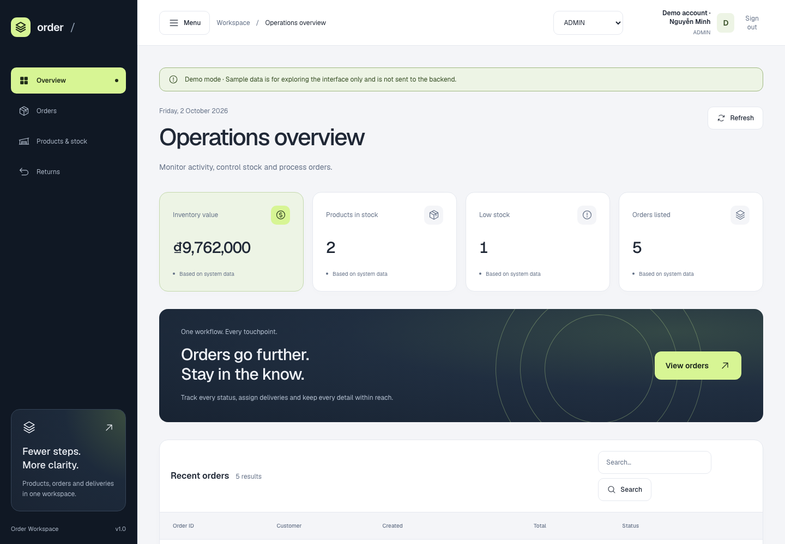
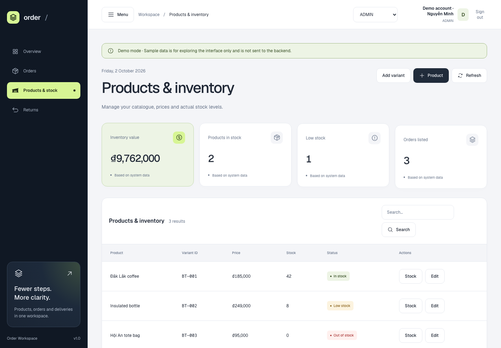
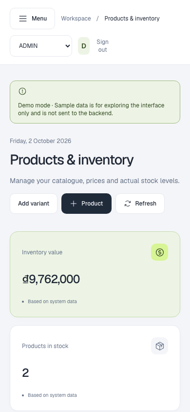
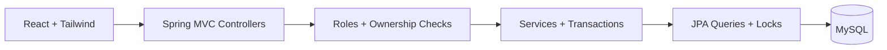

<p align="center">
  
</p>

<h1 align="center">Order Workspace</h1>
<p align="center"><strong>Every order. One workspace.</strong><br />A full-stack workspace for inventory, orders, returns, and delivery.</p>

<p align="center">
  
  
  
  
  
  
</p>

<p align="center">
  <a href="#the-workspace">Explore the UI</a> ·
  <a href="#try-it-in-two-commands">Try the demo</a> ·
  <a href="#under-the-hood">Engineering</a> ·
  <a href="#run-the-full-stack">Run locally</a>
</p>

> **Development project, not production checkout.** Explore the complete interface without a backend. Real checkout still needs its write transaction and rollback/concurrency guarantees verified.

## The workspace

A React interface with a graphite-and-lime identity, self-hosted Geist typography, GSAP motion, and role-specific workflows. The screenshots below are captured from the running application with **sample demo data**, not mock UI illustrations.

### A clear view of operations

<p align="center">
  
</p>

<table>
  <tr>
    <td width="70%"></td>
    <td width="30%"></td>
  </tr>
  <tr>
    <td align="center"><strong>Inventory, without the guesswork.</strong><br />Products, prices, variants, and stock updates.</td>
    <td align="center"><strong>Built for smaller screens.</strong><br />Responsive navigation and scrollable data tables.</td>
  </tr>
</table>

### Three roles. One connected workflow.

| Administrator | Customer | Shipper |
| :--- | :--- | :--- |
| Paginated order management | Product catalog and cart | Assigned delivery list |
| Product and inventory editing | Server-calculated checkout totals | Receive assigned orders |
| Shipper assignment | Personal order tracking | Delivery success/failure reporting |
| Return inspection and CSV export | Session-based authentication | Delivery-attempt validation |

**Interface details:** responsive layouts · light/dark workspace · reduced-motion support · loading and empty states · accessible forms and dialogs.

## Try it in two commands

```sh
npm --prefix frontend ci
npm --prefix frontend run dev
```

Open **http://localhost:5173**, choose **Enter workspace**, and use the prefilled account:

| Demo email | Demo password |
| :--- | :--- |
| `demo@order.local` | `Demo123!` |

Switch between **ADMIN**, **USER**, and **SHIPPER** in the workspace. No backend or database is needed for the demo.

<details>
<summary><strong>How the demo stays separate from real authentication</strong></summary>

- Mock API interception runs only in Vite development mode.
- Demo credentials do not create a MySQL account or authorize backend requests.
- Sample mutations live in browser memory and reset on reload.
- A separate session-storage flag remembers demo login for the current tab.
- Production builds use real backend authentication; demo login is disabled.

</details>

## Under the hood

The project demonstrates practical relational-backend engineering, not just CRUD screens.

| Engineering focus | Implementation |
| :--- | :--- |
| **Large-dataset pagination** | Database-level pages, deterministic sorting, validated page sizes, and 500-row keyset export batches. |
| **Race-condition controls** | Pessimistic row locks, write transactions on cart/inventory/delivery paths, ordered inventory locking, and stale-attempt checks. |
| **SQL optimization** | DTO projections, bulk lookups, selected database aggregates, and composite-index scripts. |
| **N+1 mitigation** | Fetch joins, entity graphs, and batched relationship retrieval on selected read paths. |
| **Security boundaries** | Session authentication, server-side roles, ownership checks, and shipper-assignment validation. |

<details>
<summary><strong>Pagination and large-dataset handling</strong></summary>

Order and return lists use Spring Data `Page`/`PageRequest` so the database limits returned records instead of the browser downloading every row. Page sizes are validated from **1 to 100**; inventory search currently uses **four rows per page**. Interactive lists sort by creation time and ID for a deterministic tie-breaker.

Return CSV exports use **ID-based keyset pagination**, reading up to **500 parent return rows** per batch with `id < lastSeenId`. DTO projections and one bulk reason lookup per batch avoid increasingly deep offsets, total-count queries, and retaining every exported entity graph. Output is written to a temporary file, downloaded, and cleaned up.

**Limits:** this is large relational-dataset handling, not proven distributed big-data processing. UUID cursor order is not chronological. Interactive offset pages can be expensive at depth; CSV generation is synchronous and needs disk space. Catalog reads and some summaries remain unbounded. No million-row benchmark is claimed.

</details>

<details>
<summary><strong>Race conditions, locks, and transaction boundaries</strong></summary>

- Cart mutations and inventory updates use pessimistic write locks inside write transactions to reduce lost updates.
- Multi-variant inventory locking requests variant-ID order to reduce deadlock risk.
- Delivery assignment and state transitions lock the order. Order changes, tracking history, and applicable notifications persist in the same write transaction.
- Reassignment or delivery retry creates a new `deliveryAttemptId`; stale attempts are rejected with a conflict.
- Delivery outcomes verify the authenticated shipper, assignment, allowed transition, recipient, address, and attempt token.

Attempt tokens are application-level stale-request guards, **not** JPA `@Version` optimistic locking. Targeted controls do not eliminate every race or deadlock.

**Checkout limitation:** `createOrder` inherits a class-level read-only transaction without a write override. Its stock checks and repository locks do not establish reliable write persistence, atomicity, or rollback. Real checkout must be corrected and tested first.

</details>

<details>
<summary><strong>SQL optimization and composite indexes</strong></summary>

Selected tracking/export queries use DTO or scalar projections. Cart inventory and return relationships use bulk lookups; selected summaries aggregate in the database rather than requiring full entity graphs.

Manual SQL scripts provide:

| Query purpose | Index columns |
| :--- | :--- |
| Unfiltered return export | `(deleted, id DESC)` |
| Status-filtered return export | `(deleted, status, id DESC)` |
| Pending notification polling | `(processed_at, deleted, created_at)` |

These scripts must be applied to the actual database. Their presence does not prove deployed indexes or performance improvements. `LOWER(...) LIKE '%...%'` substring searches generally cannot benefit from ordinary B-tree prefix/range lookup. Use MySQL `EXPLAIN` and representative data to measure real query plans.

</details>

<details>
<summary><strong>Where N+1 queries are mitigated — and where they remain</strong></summary>

N+1 means a list read triggers extra relationship queries for each record. Selected paths address it explicitly:

| Read path | Approach |
| :--- | :--- |
| Cart | Fetch items with variants/products; retrieve inventory once for all variant IDs. |
| Inventory search | Fetch variant/product relationships and use a separate pagination count query. |
| Return pages | Fetch order/customer through entity graphs, then bulk-load selected return items. |
| Return export | DTO projections with one bulk reason lookup per batch. |
| Tracking items | Constructor projections select response fields directly. |

**Remaining risk:** order browsing maps each order with separate address/item repository calls and traverses lazy relationships. Query count can grow with page size. N+1 is not eliminated project-wide; query-count tests and live SQL measurements remain useful follow-up work.

</details>

## Architecture



<details>
<summary><strong>Repository layout and technology stack</strong></summary>

```text
order_services/
├── src/main/java/com/example/order_services/
│   ├── controller/
│   ├── service/
│   ├── repository/
│   ├── entity/
│   └── dto/
├── src/main/resources/
├── src/test/
├── frontend/
│   ├── src/
│   ├── tests/
│   └── package.json
├── docs/
│   ├── images/
│   └── sql/
├── pom.xml
└── README.md
```

**Backend:** Java 25, Spring Boot 4.1.1, Spring Security, Spring Data JPA, Hibernate, Bean Validation, Lombok. MySQL runtime; H2 integration tests.

**Frontend:** React 19, JavaScript/JSX, Tailwind CSS 4, Vite 6, GSAP/ScrollTrigger, Phosphor icons, self-hosted Geist.

**Verification:** Maven wrapper, JUnit/Mockito, ESLint, TypeScript checking JavaScript, and Node's test runner.

Most APIs return `{code, message, data, metadata}`; CSV endpoints return files. Acting users are resolved from authenticated email. Money is calculated server-side with `BigDecimal`.

</details>

## Run the full stack

**Requirements:** JDK **25**, Node.js **22 LTS** recommended, npm, and an existing compatible MySQL schema. Maven is supplied through the wrapper.

```sh
export JAVA_HOME="/path/to/jdk-25"
export SPRING_DATASOURCE_URL="jdbc:mysql://localhost:3306/order_services"
export SPRING_DATASOURCE_USERNAME="your-local-user"
export SPRING_DATASOURCE_PASSWORD="your-local-password"
./mvnw spring-boot:run
```

In another terminal:

```sh
npm --prefix frontend ci
npm --prefix frontend run dev
```

Vite proxies `/api` to `http://localhost:8080` and forwards session cookies. To change the target:

```sh
API_TARGET=http://localhost:8081 npm --prefix frontend run dev
```

<details>
<summary><strong>Database preparation, real accounts, and deployment</strong></summary>

Hibernate uses `ddl-auto: validate`, not schema creation or automatic migration. **A complete database bootstrap is not included.** Review these incremental scripts against your existing schema:

- [Address city](docs/sql/address-city.sql)
- [Notification changes and index](docs/sql/order-notifications.sql)
- [Return export indexes](docs/sql/order-return-export-indexes.sql)

Delivery also requires `orders.shipper_id`, `orders.assigned_at`, `orders.delivery_attempt_id`, and `tracking_logs.recipient_name`, `tracking_logs.failure_reason`, `tracking_logs.delivery_attempt_id`. Their migration scripts are not supplied.

Real login requires existing users with BCrypt password hashes and database role assignments. There is no registration or complete account-seeding procedure. Authentication uses `JSESSIONID`; HTTP Basic is also supported. Roles are independent. Keep credentials outside Git; Spring Boot does not automatically load frontend `.env` files.

Use `mvnw.cmd` on Windows and `SERVER_PORT` to change the backend port.

For production, serve the frontend and reverse-proxy `/api` under the same origin. Separate origins need an explicit credential-aware CORS allowlist, which is not configured here.

```sh
npm --prefix frontend run build
npm --prefix frontend run preview
```

Preview serves the build, not a production API reverse proxy. It does not enable the demo.

</details>

## Verify the project

```sh
npm --prefix frontend run lint
npm --prefix frontend run typecheck
npm --prefix frontend test
npm --prefix frontend run build
```

<details>
<summary><strong>Backend checks and test scope</strong></summary>

```sh
./mvnw -DskipTests compile
./mvnw -Dtest=CartServiceTest,InventoryServiceTest,AuthIntegrationTest test
./mvnw -Dtest=OrderReturnsIntegrationTest,OrderReturnFilterTest test
./mvnw test
./mvnw package
java -jar target/Order_Services-0.0.1-SNAPSHOT.jar
```

Java compilation is the backend type check; there is no standalone lint task. H2 integration tests do not verify MySQL schema, runtime lock behavior, or execution plans. The full suite is not certified green; checkout rollback/concurrency tests describe a deferred requirement and may fail.

Frontend tests cover API envelopes, session-cookie options, demo credentials, cart/stock mutations, and delivery contracts. TypeScript checks JavaScript/JSX without converting the application to TypeScript.

</details>

## API & project notes

<details>
<summary><strong>API map</strong></summary>

| Area | Endpoints | Access |
| :--- | :--- | :--- |
| Authentication | `POST /api/auth/login`, `GET /api/auth/me`, `POST /api/auth/logout` | Login public; session endpoints authenticated |
| Catalog/options | `GET /api/catalog`, `/api/addresses`, `/api/payments`, `/api/discounts` | USER |
| Cart | `GET /api/carts`, `POST /api/carts/items`, `PATCH /api/carts/items/{cartItemId}/quantity` | USER |
| Checkout | `POST /api/orders/orders/summary`, `POST /api/orders` | USER |
| Personal orders | `GET /api/orders/mine`, `GET /api/orders/tracking/{id}` | USER, owner-scoped |
| Order administration | `GET /api/orders`, `GET /api/orders/{id}`, `GET /api/shippers` | ADMIN |
| Delivery management | `PATCH /api/orders/{id}/shipper`, `PATCH /api/orders/tracking/{id}/state` | ADMIN |
| Products | `POST /api/products`, `POST /api/products/{productId}/variants` | ADMIN |
| Inventory | `GET /api/inventories`, `GET /api/inventories/products-in-stock`, `PUT /api/inventories/{productVariantId}/quantity` | ADMIN |
| Product editing | `PATCH /api/inventories/productsInStock/{productId}/variants/{variantsId}` | ADMIN |
| Returns | `GET /api/orders/returns/summary!`, `/api/orders/returns`, `/api/orders/returns/{id}`, `/api/orders/return/export` | ADMIN |
| Shipper reads | `GET /api/shipper/orders`, `GET /api/shipper/orders/{id}` | SHIPPER, assignment-scoped |
| Shipper actions | `POST /api/shipper/orders/receive`, `/api/shipper/orders/delivered`, `/api/shipper/orders/failed` | SHIPPER, assignment/attempt checks |

The repeated `/orders` and trailing `!` are actual mappings. Order lists accept `page`, `size`, `state`, `query`; returns accept `page`, `size`, `filterBy`; inventory accepts `query`, `page`. Pages are zero-based.

</details>

<details>
<summary><strong>Known limitations before production</strong></summary>

- Checkout needs a correct write transaction and rollback/concurrency verification.
- Complete schema bootstrap and some delivery migrations are missing.
- Address/payment entities lack ownership columns. Lookup endpoints expose only records referenced by the current user's existing orders; first-time customers can lack checkout options. Checkout still relies on existence/foreign-key validation of IDs.
- Discount assignment dates are not validated.
- CSRF is disabled for local learning; restore protection before deploying cookie-based authentication.
- Notifications log payloads rather than send email/SMS. Single-JVM synchronization does not provide multi-instance claiming/idempotency.
- Some reads remain unbounded or vulnerable to N+1; no load-test or SQL benchmark results are claimed.

</details>

<details>
<summary><strong>Add or replace screenshots</strong></summary>

Images live in [`docs/images/`](docs/images/). Replace `welcome.png`, `dashboard.png`, `inventory.png`, or `mobile.png` to refresh the embedded gallery. Add `orders.png`, `returns.png`, `customer.png`, and `shipper.png` as the project grows.

```markdown

```

Use demo data and avoid publishing customer information, passwords, or session cookies.

</details>

<p align="center">
  <a href="docs/login-api.md">Authentication</a> ·
  <a href="docs/checkout-api.md">Checkout</a> ·
  <a href="docs/estimated-delivery.md">Tracking</a> ·
  <a href="docs/order-returns-api.md">Returns & CSV</a> ·
  <a href="AGENTS.md">Contributor conventions</a>
</p>

Historical specs in `.scratch/` and `docs/superpowers/` can differ from current behavior. Verify contracts against the code and tests.
